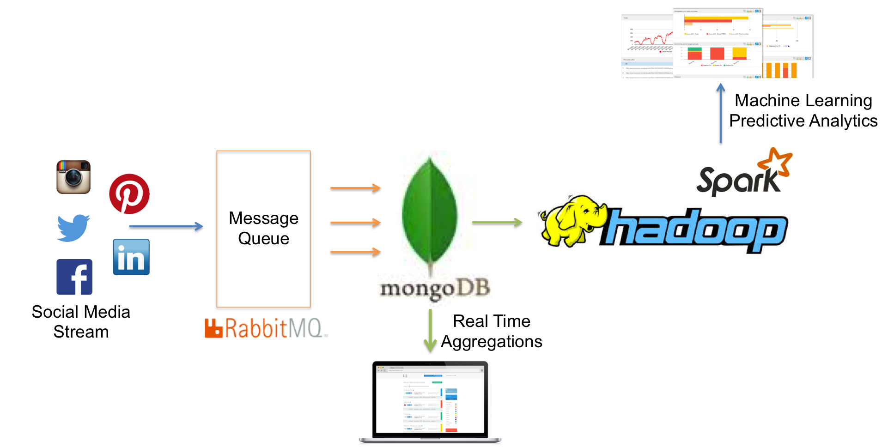
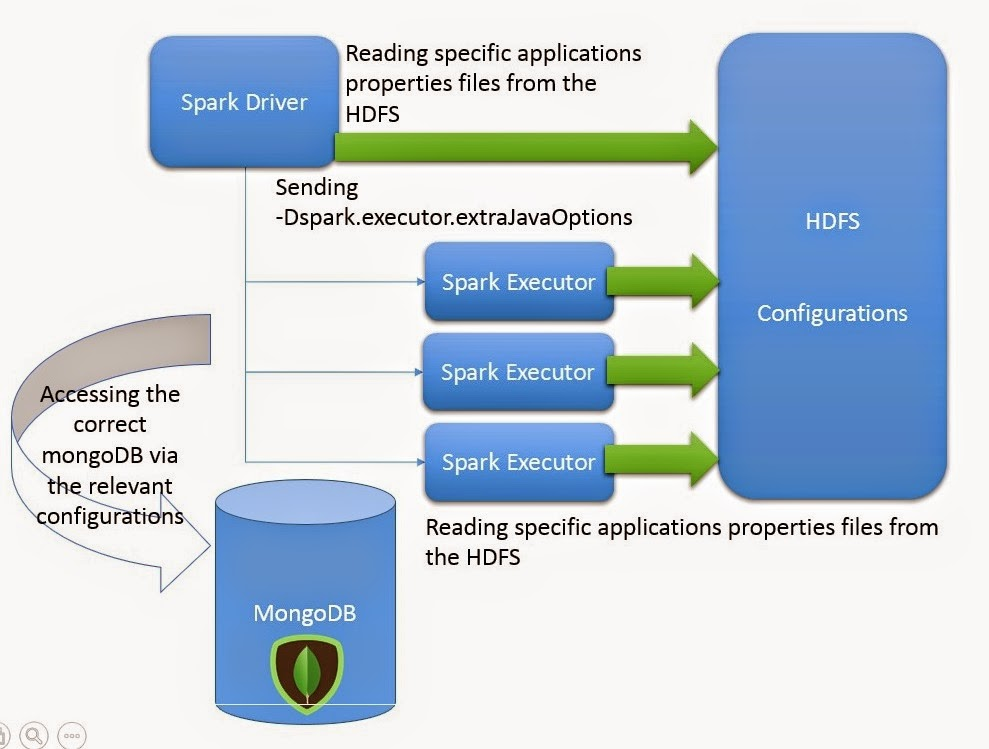
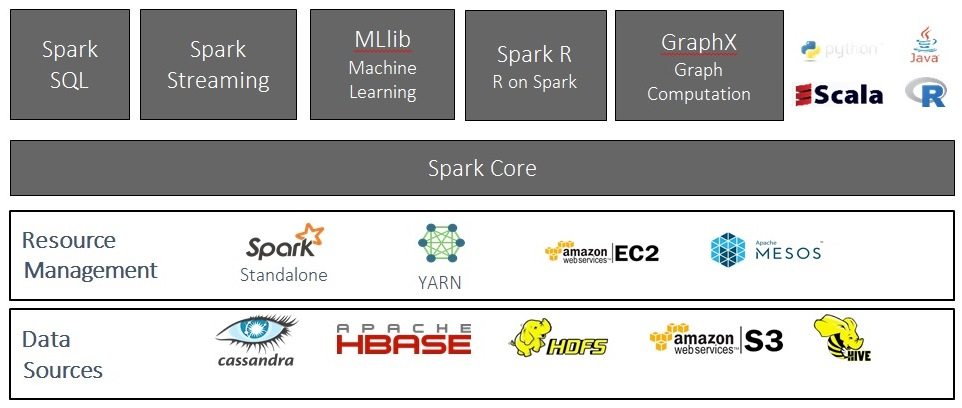

Big Data cluster framework
============

## Good Reads
* [The Hadoop Ecosystem Table](https://hadoopecosystemtable.github.io/)
* [Hadoop and MongoDB](https://www.mongodb.com/hadoop-and-mongodb)
* [Using MongoDB with Hadoop & Spark: Part 1](https://www.mongodb.com/blog/post/using-mongodb-hadoop-spark-part-1-introduction-setup?jmp=docs&_ga=1.169511393.1901625411.1481269178)
* [Running Hadoop on Ubuntu Linux (Single-Node Cluster)](http://www.michael-noll.com/tutorials/running-hadoop-on-ubuntu-linux-single-node-cluster/)
* [MongoDB Integration & Tools](https://docs.mongodb.com/ecosystem/tools/hadoop/)
* [Hadoop Vs. MongoDB](http://www.aptude.com/blog/entry/hadoop-vs-mongodb-which-platform-is-better-for-handling-big-data)
* [Social Media Analytics with Cloud Manager, Hadoop and Apache using-mongodb-hadoop-spark-part-1-introduction-setup](https://www.mongodb.com/blog/post/leaf-in-the-wild-hekima-unlocks-social-media-analytics-with-mongodb-hadoop-and-apache-spark)
* [Hadoop Big Data Analytics](http://www.cisco.com/c/en/us/solutions/collateral/enterprise/cisco-on-cisco/BigData_Case_Study-1.html)
* [Big Data Processing with Apache Spark](https://www.infoq.com/articles/apache-spark-introduction)
* [Spark – A modern data processing framework for cross platform analytics](http://h20195.www2.hpe.com/V2/getpdf.aspx/4AA6-8143ENW.pdf)
* [The Big-Data Ecosystem Table](http://bigdata.andreamostosi.name/)
* [An Introduction to Big Data Concepts and Terminology](https://www.digitalocean.com/community/tutorials/an-introduction-to-big-data-concepts-and-terminology)

## Images



## Frameworks for Big Data
### Lambda
[Docs](http://lambda-architecture.net/)

### Kappa
[Docs](http://milinda.pathirage.org/kappa-architecture.com/)

## Hadoop
### Good reads
* [Hadoop Installation](http://doctuts.readthedocs.io/en/latest/hadoop.html)
* [Hadoop documents](https://hadoop.apache.org/docs/stable/hadoop-project-dist/hadoop-common/SingleCluster.html)
* [Components of the Hadoop Ecosystem](https://acadgild.com/blog/big-data-terminologies-must-know/)
* [Getting Hadoop Up and Running on Ubuntu](https://dzone.com/articles/getting-hadoop-and-running)
* [Hadoop deployment Cheat sheet](https://jethro.io/hadoop-deployment-cheat-sheet/)
* [Hadoop: Writing and Running Your First Project](http://www.drdobbs.com/database/hadoop-writing-and-running-your-first-pr/240153197?pgno=1)
* [Video tutorial - An hour with Big Data and Hadoop Architecture ](https://www.youtube.com/watch?v=y05J_pKD47c)
* [MapReduce VS Yarn](http://stackoverflow.com/questions/31044575/mapreduce-2-vs-yarn-applications)
* [Hadoop Tutorial Series](https://www.edureka.co/blog/hadoop-tutorial/?utm_source=blog&utm_medium=left-menu&utm_term=Hadoop%20Tutorial:%20All%20you%20need%20to%20know%20about%20Hadoop!)
* [Multitenancy on Hadoop](https://www.oreilly.com/ideas/multitenancy-on-hadoop-is-your-cluster-half-full)

### Install & Setting up
#### Hadoop Ports
[Reference Hortonworks 1](https://docs.hortonworks.com/HDPDocuments/HDP2/HDP-2.4.0/bk_HDP_Reference_Guide/bk_HDP_Reference_Guide-20160301.pdf)
[Reference Hortonworks 2](https://docs.hortonworks.com/HDPDocuments/HDP2/HDP-2.3.2-Win/bk_HDP_Install_Win/content/ref-79239257-778e-42a9-9059-d982d0c08885.1.html)

__HDFS Ports__

|          Service          | Default ports | Protocol |       Configuration        |                   Descriptions                  |
| ------------------------- | ------------- | -------- | -------------------------- | ----------------------------------------------- |
| NameNode WebUI            | 50070         | http     | dfs.http.address           | WebUI to look at current spark-architectures    |
|                           | 50470         | https    | dfs.https.address          |                                                 |
| NameNode metadata service | 8020/9000     | IPC      |                            | File system metadata operations                 |
| DataNode                  | 50075         | http     | dfs.datanode. http.address | DataNode WebUI to access the status, logs, etc. |
|                           | 50475         | https    | dfs.datanode.https.address | Secure http service                             |
|                           | 50010         |          | dfs.datanode.address       | Data transfer                                   |
|                           | 50020         | IPC      | dfs.datanode.ipc.address   | Metadata operations                             |
| Secondary NameNode        | 50090         | http     | dfs.secondary.http.address | Checkpoint for NameNode metadata                |


### Cheat Sheet
```
hadoop namenode -format
hadoop namenode -format
```
Starting your single-node cluster
```
/usr/local/hadoop/bin/stop-all.sh
/usr/local/hadoop/bin/start-all.sh
```
Creating the Home Directory
```
$ hdfs dfs -mkdir /user
$ hdfs dfs -mkdir /user/hadoop
```

Use following command to copy input files into HDFS. 
```
hdfs dfs -put $HADOOP_PREFIX/etc/hadoop input
```

Use following commands to copy the output files from HDFS to local file system and view them. 
```
$ hdfs dfs -get output output
$ cat output/*
```

OR you can use following command to View the output files on HDFS itself.
```
$ bin/hdfs dfs -cat output/*
```

### MapReduced program
* [Hadoop Basics - Creating a MapReduce Program](https://dzone.com/articles/hadoop-basics-creating)
* [Writing an Hadoop MapReduce Program in Python](http://www.michael-noll.com/tutorials/writing-an-hadoop-mapreduce-program-in-python/)
* [Building Hadoop MapReduce Jobs In Java](http://www.higherpass.com/java/Tutorials/Building-Hadoop-Mapreduce-Jobs-In-Java/1/)
* [Writing a Hadoop MapReduce task in Java](https://pragmaticintegrator.wordpress.com/2013/08/16/writing-a-hadoop-mapreduce-task-in-java/)

## MongoDB Hadoop Connector 
### Good reads
* [Mongo-Hadoop-wiki](https://github.com/mongodb/mongo-hadoop/wiki)
* [Monngo-Hadoop-github](https://github.com/mongodb/mongo-hadoop)
* [Java Mongo Example](http://www.mkyong.com/mongodb/java-mongodb-hello-world-example/)
* [Java Mongo Example 1](http://www.programcreek.com/java-api-examples/index.php?api=com.mongodb.MongoClient)
* [Example Mongo-Hadoop](https://gist.github.com/fernandojunior/1231cba3325cdca6239d)
* [Hadoop-mongodb the beginning](http://artemyankov.com/hadoop-10--mongodb-the-beginning/)
* [Mongo+Hadoop](http://dws.la/mongodb-hadoop-match-made-heaven/)

### Mongo Java Program
#### Good reads
* [Java-mongodb-hello-world-example](http://www.mkyong.com/mongodb/java-mongodb-hello-world-example/)
* [Java Code Examples for com.mongodb.MongoClient](http://www.programcreek.com/java-api-examples/index.php?api=com.mongodb.MongoClient)

## Spark
### Good reads
* [Apache Spark](https://dzone.com/refcardz/apache-spark)
* [Spark guideline](https://ongxuanhong.wordpress.com/2015/11/18/huong-dan-cai-dat-apache-spark-standalone-mode/)
* [Step by Step of installing Apache Spark on Apache Hadoop](https://chongyaorobin.wordpress.com/2015/07/01/step-by-step-of-installing-apache-spark-on-apache-hadoop/)
* [Introduction to apache spark](http://www.slideshare.net/UserReport/introduction-to-apache-spark-36594310)
* [Mastering Apache Spark](https://jaceklaskowski.gitbooks.io/mastering-apache-spark/content/spark-architecture.html)
* [Apache Spark and Hadoop](https://www.collaberatact.com/apache-spark-hadoop-locking-horns/)
* [Introduction to Apache Spark Part 1](http://www.mammatustech.com/introduction-to-apache-spark)
* [Apache Spark Operations](http://www.slideshare.net/cloudera/apache-spark-operations)

### Images






### Install
Install Java

Install Scala [Download](http://www.scala-lang.org/files/archive/)
```
wget www.scala-lang.org/files/archive/scala-2.11.8.deb
sudo dpkg -i scala-2.11.8.deb
```

Install sbt
```
echo "deb https://dl.bintray.com/sbt/debian /" | sudo tee -a /etc/apt/sources.list.d/sbt.list
sudo apt-key adv --keyserver hkp://keyserver.ubuntu.com:80 --recv 642AC823
sudo apt-get update
sudo apt-get install sbt
```

Install Spark bin [Download](http://spark.apache.org/downloads.html)

### Configuration and Spark Ports
Spark-master: localhost:8080
* [Configuring Ports for Network Security](http://spark.apache.org/docs/latest/security.html)
* [Configuring and Running Spark (Standalone Mode)](https://www.cloudera.com/documentation/enterprise/5-2-x/topics/cdh_ig_spark_configure.html)

### Spark Programing
#### Good reads
* [Apache Spark example with Java and Maven](http://www.robertomarchetto.com/spark_java_maven_example)
* [Hadoop-framework-examples](https://github.com/rathboma/hadoop-framework-examples/)
* [Apache Spark Scala Tutorial with Examples](http://beekeeperdata.com/posts/hadoop/2015/12/14/spark-scala-tutorial.html)
* [Introduction to Apache Spark with Examples and Use Cases](https://www.toptal.com/spark/introduction-to-apache-spark)
* [PySpark Tutorials](https://www.dezyre.com/apache-spark-tutorial/pyspark-tutorial)
* [PySpark Programming Guide](https://spark.apache.org/docs/0.9.1/python-programming-guide.html)
* [Apache-spark-installation-tutorial](https://www.dezyre.com/apache-spark-tutorial/apache-spark-installation-tutorial)
* [Start-spark](https://github.com/bbouille/start-spark)

#### PySpark Shell
> ./bin/pyspark 

> JAVA_HOME=<Location-of-java-lib> && ./bin/pyspark

```
# Accessing Hadoop HDFS
text_file = sc.textFile("hdfs://localhost:9000/user/vanvv/input/fulldictionary.txt")
text_file.count()
```

#### Running a Spark application in Standalone Mode
sampleapp.py

    #!/usr/bin/env python
    from pyspark import SparkConf, SparkContext

    conf = SparkConf().setAppName('MyFirstStandaloneApp')
    sc = SparkContext(conf=conf)

    text_file = sc.textFile("hdfs://localhost:9000/user/vanvv/input/fulldictionary.txt")
    count = text_file.count()
    print "DB Count", count

```
spark-submit sampleapp.py
```

#### MongoDB Spark Connector
[Starter](https://docs.mongodb.com/spark-connector/v1.1/getting-started/)
[Spark Connector Python Guide](https://docs.mongodb.com/spark-connector/master/python-api/)
[Github_mongo-spark](https://github.com/mongodb/mongo-spark)


#### Launching Spark Application on a Cluster

#### Sparl-Shell
```
val textFile = sc.textFile("hdfs://localhost:9000/user/vanvv/input/fulldictionary.txt")
textFile.count
```

#### Sparl Sql

#### Spark Streaming

