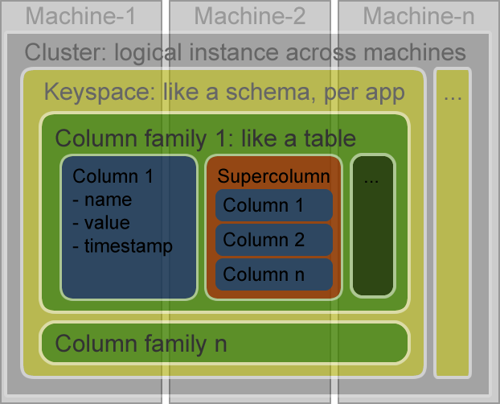

Cassandra DB
====================================

## Good reads
* https://www.jamescoyle.net/how-to/2448-create-a-simple-cassandra-cluster-with-3-nodes
* [A quick glance into Cassandra](https://community.toadworld.com/platforms/nosql/w/wiki/11687.a-quick-glance-into-cassandra)
* [Introduction to Apache Cassandra's Architecture](https://dzone.com/articles/introduction-apache-cassandras)
* [Cassandra Tutorial](https://www.guru99.com/cassandra-architecture.html)
* [Designing a Cassandra Data Model](https://shermandigital.com/blog/designing-a-cassandra-data-model/)
* [Deploy a highly-available Cassandra cluster in AWS using Kubernetes](https://medium.com/merapar/deploy-a-high-available-cassandra-cluster-in-aws-using-kubernetes-bd8ba07bfcdd)
* [Cassandra-data-modeling-best-practices](https://www.slideshare.net/jaykumarpatel/cassandra-data-modeling-best-practices)
* [Cassandra NoSQL Data Model Design](http://highscalability.com/blog/2017/11/13/cassandra-nosql-data-model-design.html)
* [Designing a Cassandra Data Model](https://shermandigital.com/blog/designing-a-cassandra-data-model/)
* [Install Cassandra on Ubuntu 16.04](https://www.itzgeek.com/how-tos/linux/ubuntu-how-tos/install-cassandra-on-ubuntu-16-04-and-run-a-single-node-cassandra-cluster-on-ubuntu.html)
* [How to Install Apache Cassandra on Ubuntu 16.04](https://www.rosehosting.com/blog/how-to-install-apache-cassandra-on-ubuntu-16-04/)

## Terms
* Keyspace - Database
* Column Family - Table
* Partition Key - Primary Key
* Column Name/Key - Column Name
* Column Value - Column Value
* Data Partitioning
* Consistent Hashing
* Data Replication
* Eventual Consistency
* Tunable Consistency
* Consistency Level
* Data Centre, Racks, Nodes
* Snitches and Replication Strategies
* Gossip Protocol
* Bloom Filters
* Merkle Tree
* SSTable 
* Write Back Cache
* Memtable 
* Cassandra Keyspace
* Column Family
* Row Key 

## Cassandra Architecture


## Setup cluster Cassandra
[Deploy a highly-available Cassandra cluster in AWS using Kubernetes](https://medium.com/merapar/deploy-a-high-available-cassandra-cluster-in-aws-using-kubernetes-bd8ba07bfcdd)
[Apache Cassandra for HealthCare Data Analytics](https://medium.com/@gp_pulipaka/apach)
[Scalable Cassandra deployment on Kubernetes](https://github.com/IBM/Scalable-Cassandra-deployment-on-Kubernetes)


## Cassandra model

### Key points
* No join, no group by,  filter in primary key only



__Case stusy - Supercolumn__


### Basic Rules of Cassandra Data Modeling
[Reference 1](https://www.datastax.com/dev/blog/basic-rules-of-cassandra-data-modeling)

__Non-goal__(Don't pay attention)
* Minimize the Number of Writes
* Minimize Data Duplication

__Goal__
* Spread data evenly around the cluster: pick a good primary key
* Minimize the number of partitions read: 

### Primary Key
__Primary Key__: Is composed of partition key(s) [and optional clustering keys(or columns)]
__Partition Key__: The hash value of Partition key is used to determine the specific node in a cluster to store the data
__Clustering Key__: Is used to sort the data in each of the partitions(or responsible node and it's replicas)
__Compound Primary Key__: As said above, the clustering keys are optional in a Primary Key. If they aren't mentioned, it's a simple primary key. If clustering keys are mentioned, it's a Compound primary key.
__Composite Partition Key__: Using just one column as a partition key, might result in wide row issues (depends on use case/data modeling). Hence the partition key is sometimes specified as a combination of more than one column.

_Examples:_

    PRIMARY KEY (a): The partition key is a.
    PRIMARY KEY (a, b): The partition key is a, the clustering key is b.
    PRIMARY KEY ((a, b)): The composite partition key is (a, b).
    PRIMARY KEY (a, b, c): The partition key is a, the composite clustering key is (b, c).
    PRIMARY KEY ((a, b), c): The composite partition key is (a, b), the clustering key is c.
    PRIMARY KEY ((a, b), c, d): The composite partition key is (a, b), the composite clustering key is (c, d).

[Ref](https://stackoverflow.com/questions/24949676/difference-between-partition-key-composite-key-and-clustering-key-in-cassandra)
[Cassandra Data Modeling: Primary, Clustering, Partition, and Compound Keys](https://dzone.com/articles/cassandra-data-modeling-primary-clustering-partiti) 

__Notes: querying clustered composite keys__
When issuing a CQL query, you must include all partition key columns, at a minimum. You can then apply an additional filter by adding each clustering key in the order in which the clustering keys appear.

### Design Cassandra DB
[Cassandra Data Model Rules](https://www.guru99.com/cassandra-data-model-rules.html)

## CQL No-Sql 
[Referance from Datastax](https://docs.datastax.com/en/dse/5.1/cql/)
[Reference from Cassandra homepage](http://cassandra.apache.org/doc/latest/cql/index.html)

### Command syntax
[Understanding the CQL command syntax](https://docs.datastax.com/en/dse/5.1/cql/cql/cql_using/cqlSyntax.html#cqlSyntax)

### CQL data type

> cql_type ::=  native_type | collection_type | user_defined_type | tuple_type | custom_type

* __Native type__: 
```
	native_type ::=  ASCII
                 | BIGINT
                 | BLOB
                 | BOOLEAN
                 | COUNTER
                 | DATE
                 | DECIMAL
                 | DOUBLE
                 | DURATION
                 | FLOAT
                 | INET
                 | INT
                 | SMALLINT
                 | TEXT
                 | TIME
                 | TIMESTAMP
                 | TIMEUUID
                 | TINYINT
                 | UUID
                 | VARCHAR
                 | VARINT
```

* __Collection type__:
```
collection_type ::=  MAP '<' cql_type ',' cql_type '>'
                     | SET '<' cql_type '>'
                     | LIST '<' cql_type '>'
```

## Cassandra with Loopback framework
[Reference](https://loopback.io/doc/en/lb3/Cassandra-connector.html#v1-limitations)

### Define model Cassandra in Loopback

* __Assign Partition Key__
When id: true is defined, LoopBack does not add id and uses it as a partition key

__'Medias' Model__
```
{
  "name": "Medias",
  "base": "PersistedModel",
  "idInjection": true,
  "options": {
    "validateUpsert": true
  },
  "properties": {
    "mediaid": {
      "type": "number",
      "id": true
    },
    "text": {
      "type": "string"
    }
  },
  "validations": [],
  "relations": {},
  "acls": [],
  "methods": {}
}
```

_Cql equivalent:_

```
CREATE TABLE customers (
   mediaid INT,
   text TEXT,
   PRIMARY KEY (mediaid)
);
```

* __Assign Clustering Key__

Add field '"cassandra": {"clusteringKeys": [<field_name>]}' to "options" field

_Examples_

__'user' Model__
```
{
  "name": "Groups",
  "base": "PersistedModel",
  "idInjection": false,
  "options": {
    "validateUpsert": true,
    "cassandra": {
      "clusteringKeys": ["id"]
    }
  },
  "properties": {
    "id": {
      "type": "number",
      "required": true
    },
    "userId": {
      "type": "number",
      "id": true,
      "required": true
    },
    "username": {
      "type": "string",
      "required": true
    },
    "type": {
      "type": "string",
      "required": true
    }
  },
  "validations": [],
  "relations": {},
  "acls": [],
  "methods": {}
}
```

_Cql equivalent:_

```
CREATE TABLE customers (
   id INT,
   userId INT,
   username TEXT,
   type TEXT,
   PRIMARY KEY (userId, id)
);
```