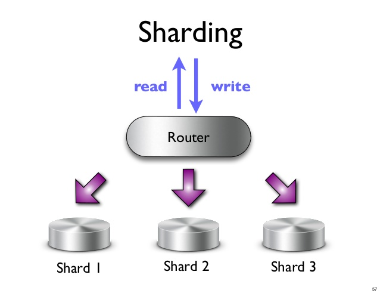

Database 
----------

## Terms
* Relational databases
* RDBMS
* NoSQL Databases: 
    * Key-Value databases
    * Document databases
    * Column family stores
    * Graph Databases
* Cluster
* Data storage
* Volumes of data
* ERP application
* Aggregate Data Models
* Collection of data
* Key-value, Document, and Column-family databases
* Aggregate-oriented databases
* Inter-aggregate relationships
* Intra-aggregate relationships
* Distribution Models
* Sharding
* Replication
* Master-slave replication
* Peer-to-peer replication
* CAP theorem
* Scaling Up - vertical scaling
* Scaling Out - horizontal scaling
* ACID
* BASE

## Good readings
[NoSQL Databases: An Overview](https://www.thoughtworks.com/insights/blog/nosql-databases-overview)
[10 things you should know about NoSQL databases](http://www.techrepublic.com/blog/10-things/10-things-you-should-know-about-nosql-databases/)
[Database per service in Microservice](http://microservices.io/patterns/data/database-per-service.html)
[Database Sharding](http://www.agildata.com/database-sharding/)
[Database Sharding Explained](http://nosql-guide.com/database-sharding-explained/)
[Linux Database tools](http://www.yolinux.com/TUTORIALS/LinuxDatabases.html)
[NoSQL and Data Scalability ](https://dzone.com/refcardz/nosql-and-data-scalability-20)
[Practical NoSQL resilience design pattern for the enterprise](http://www.ebaytechblog.com/2017/02/14/practical-nosql-resilience-design-pattern-for-the-enterprise/)
[A deep dive into NoSQL: A complete list of NoSQL databases](http://bigdata-madesimple.com/a-deep-dive-into-nosql-a-complete-list-of-nosql-databases/)
[NoSQL](http://www.w3resource.com/mongodb/nosql.php)
[Spark and NoSql](https://blog.couchbase.com/why-spark-and-nosql/)
[The NoSQL and Spark Ecoystem: A C-Level Guide](https://practicalanalytics.co/2015/06/02/the-maturing-nosql-ecoystem-a-c-level-guide/)
[3 Tips for Selecting the Right Database for Your App](https://dzone.com/articles/3-tips-for-selecting-the-right-database-for-your-a)
[A Comparison Of NoSQL Database Management Systems And Models](https://www.digitalocean.com/community/tutorials/a-comparison-of-nosql-database-management-systems-and-models)
[Multimodel database](https://www.slideshare.net/JiahengLu1/multimodel-database)
[Nosql-data-modeling-techniques](https://highlyscalable.wordpress.com/2012/03/01/nosql-data-modeling-techniques/)

## Questions
> How to design Database for microservice ?

> What type of Database used for Big-Data ?

> What is No-Sql database ? Theory ?

> Why choose No-Sql database ?

> How to scale database in Cluster ? Methods ?

> Which DB is used ?

> Pattern for cloud DB ?

> Steps for design DB ?

## CAP Theorem
* __Consistency:__ This means that the data in the database remains consistent after the execution of an operation. For example after an update operation all clients see the same data.

* __Availability:__ Every operation must terminate in an intended response. This means that the system is always on (service guarantee availability), no downtime.

* __Partition tolerance:__ Operations will complete, even if individual components are unavailable. This means that the system continues to function even the communication among the servers is unreliable, i.e. the servers may be partitioned into multiple groups that cannot communicate with one another.

## ACID Solutions

ACID database transactions greatly simplify the job of the application developer. As signified by the acronym, ACID transactions provide the following guarantees:

__Atomicity:__ All of the operations in the transaction will complete, or none will.

__Consistency:__ The database will be in a consistent state when the transaction begins and ends.

__Isolation:__ The transaction will behave as if it is the only operation being performed upon the database.

__Durability:__ Upon completion of the transaction, the operation will not be reversed.

## NoSQL Databases

- Not using the relational model
- Running well on clusters
- Mostly open-source
- Built for the 21st century web estates
- Schema-less

### Summary
- Stands for Not Only SQL
- No declarative query language
- No predefined schema 
- Key-Value pair storage, Column Store, Document Store, Graph databases
- Eventual consistency rather ACID property 
- Unstructured and unpredictable data
- CAP Theorem 
- Prioritizes high performance, high availability and scalability
- BASE Transaction

### Why use ?
* Size matters:
If will be working with very large sets of data, consistently scaling is easier to achieve with many of the DBMS from NoSQL family.

* Speed:
NoSQL databases are usually faster - and sometimes extremely speedier - when it comes to writes. Reads can also be very fast depending on the type of NoSQL database and data being queried.

* Schema-free design:
Relational DBMSs require structure from the beginning. NoSQL solutions offer a large amount of flexibility.

* Automated (or easy) replications / scaling:
NoSQL databases are growing rapidly and they are being actively built today - vendors are trying to tackle common issues and one of them clearly is replication and scaling. Unlike RDBMSs, NoSQL solutions can easily scale and work with(in) clusters.

* Multiple choices:
When it comes to choosing a NoSQL data store, there are a variety of models, as we have discussed, that you can choose from to get the most out of the database management system - depending on your data type.

### No-Sql Data modeling

#### Denormalization
#### Aggregates
#### Application Side Joins
#### Atomic Aggregates
#### Enumerable Keys
#### Dimensionality Reduction
#### Index Table
#### Composite Key Index
#### Aggregation with Composite Keys
#### Inverted Search – Direct Aggregation
#### Tree Aggregation
#### Adjacency Lists
#### Materialized Paths
#### Nested Sets
#### Nested Documents Flattening: Numbered Field Names
#### Nested Documents Flattening: Proximity Queries
#### Batch Graph Processing

### Data types
* Columnar
* Key-value stores
* Document
* SearchEngine
* Hybrid

### Key-Value databases
* Riak
* Redis
* Memcached
* Berkeley DB
* upscaledb
* Couchbase

### Document databases
* MongoDB
* CouchDB
* Terrastore
* OrientDB
* RavenDB

### Column family stores
* Cassandra
* HBase
* Hypertable

### Graph Databases
* Neo4J
* Infinite Graph
* OrientDB
* FlockDB

### Search engine
* Apache Solr
* Elasticsearch
* MarkLogic

### Hybrid
* OrientDB
* MarkLogic
* ArangoDB

## Improving the performance and scalability of databases
__Methods:__
* Scaling Up - vertical Scaling: Database Mirroring and Replication, Table partition
* Scaling Out - horizontal scaling: Sharding
* Load Balancing: using proxy server.

As most NoSQL databases have been built with a scale-out mentality, sharding usually works very well

### Database Partitioning
#### Master/Slave
#### Cluster Computing
#### Table Partitioning
#### Federated Tables

> __Drawbacks:__ complex administration, lack of support for critical business requirements, and high availability limitations.  

### Sharding Database
The basic concept of Database Sharding is very straightforward: take a large database, and break it into a number of smaller databases across servers.
Advantages:
	* Smaller databases are easier to manage.
	* Smaller databases are faster.
	* Database Sharding can reduce costs.

#### Sharding Nothing

#### Sharding Disk

## NoSQL resiliency design pattern

## Choosing NoSQL database
* __Key-value databases__ are generally useful for storing session information, user profiles, preferences, shopping cart data. We would avoid using Key-value databases when we need to query by data, have relationships between the data being stored or we need to operate on multiple keys at the same time.
* __Document databases__ are generally useful for content management systems, blogging platforms, web analytics, real-time analytics, ecommerce-applications. We would avoid using document databases for systems that need complex transactions spanning multiple operations or queries against varying aggregate structures.
* __Column family databases__ are generally useful for content management systems, blogging platforms, maintaining counters, expiring usage, heavy write volume such as log aggregation. We would avoid using column family databases for systems that are in early development, changing query patterns.
* __Graph databases__ are very well suited to problem spaces where we have connected data, such as social networks, spatial data, routing information for goods and money, recommendation engines

__To summarize the process I use for selecting a database:__
* Understand the data structure(s) you require, the amount of data you need to store/retrieve, and the speed/scaling requirements
* Model your data to determine if a relational, document, columnar, key/value, or graph database is most appropriate for your data.
* During the modeling process, consider things such as the ratio of reads-to-writes, along with the throughput you will require to satisfy reads and writes.
* Consider the use of multiple databases to manage data under different contexts/usage patterns.
* Always use a master database to store and retrieve canonical data, with one or more additional databases to support additional features such as searching, data pipeline processing, and caching.

## Database for Big data

## Database in Microservice

Keep each microservice’s persistent data private to that service and accessible only via its API. The following diagram shows the structure of this pattern.

Implementing queries that join data that is now in multiple databases is challenging (Complexity of managing multiple SQL and NoSQL databases). There are various solutions:

* Application-side joins - the application performs the join rather than the database. For example, a service (or the API gateway) could retrieve a customer and their orders by first retrieving the customer from the customer service and then querying the order service to return the customer’s most recent orders.

* Command Query Responsibility Segregation (CQRS) - maintain one or more materialized views that contain data from multiple services. The views are kept by services that subscribe to events that each services publishes when it updates its data. For example, the online store could implement a query that finds customers in a particular region and their recent orders by maintaining a view that joins customers and orders. The view is updated by a service that subscribes to customer and order events.

### Methods
#### Event-driven architecture pattern
#### Command Query Responsibility Segregation (CQRS) pattern

### Managing multiple NoSQL databases
