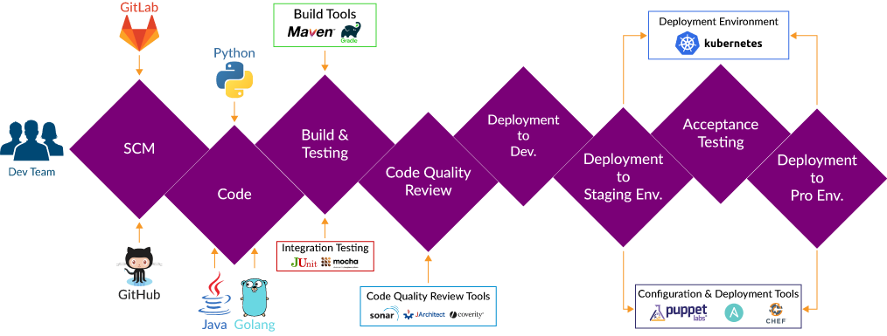
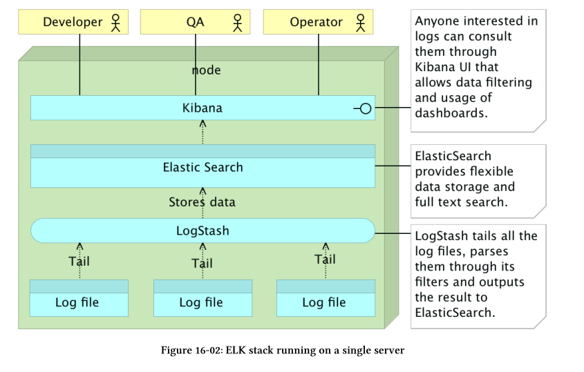
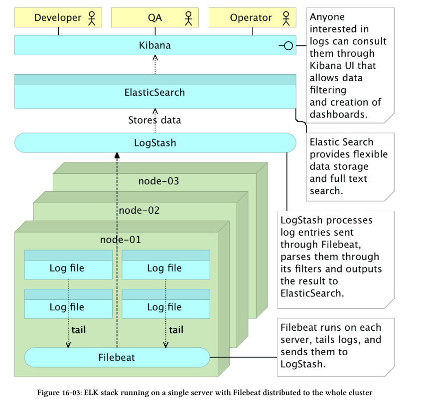
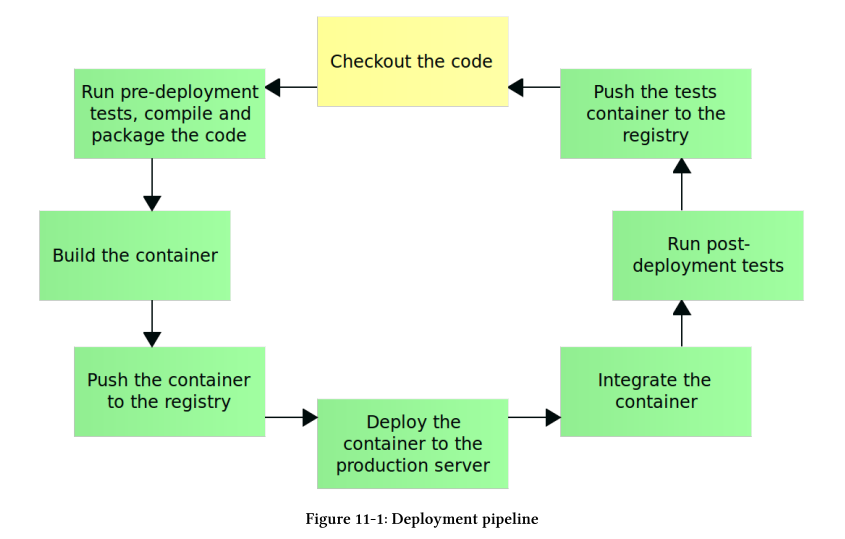

## Good links
[Top 10 Things To Know in DevOps](https://www.xenonstack.com/blog/devops/top-10-things-to-know-in-devops)

## DevOps Overview

DevOps isn't a tool or a product. DevOps is a process and balanced organization approach for improving collaboration, communication among development and operation.

Redesigning and find new ways for faster and Reliable Delivery for accelerated time to market, improved manageability, better operational efficiency, and more time to focus on your core business goals.

## 6 Cs of DevOps Adoption

* Continuous Integration

* Continuous Testing

* Continuous Delivery

* Continuous Deployment

* Continuous Monitoring

* Continuous Business Planning

## DevOps Open Source Tools

### Source Code Management Tools
	
* Github
* Gitlab

### Continuous Integration Tools

Continuous Integration is a fundamental best practice of modern Software Development. By Setting up an effective Continuous Integration environment, we can:
Reduce Integration Issues; Improve Code Quality; Improve Communication and Collaboration between Team Members; Faster Releases; Less Bugs

* Jenkins CI
* Travis CI

#### Example 1: Integration Travis to deploy APP on Kubernetes
(https://github.com/DevOps-with-Kubernetes/my-app)

### Build Tools

### Continuous Testing Tools

* Unit Testing With JUnit
* Mocha - JavaScript Test Framework

### Configuration Management Tools

### Continuous Deployment Tools

### DevOps Orchestration Tools

* Kubernetes
* Docker Swarm

### Continuous Monitoring DevOps Tools

What we need for cluster logging and monitoring is a combination of decentralized data collectors
that are sending information to a centralized parsing service and data storage. There are plenty of
products specially designed to fulfill this requirement, ranging from on-premise to cloud solutions,
and everything in between. FluentD³¹8, Loggly³¹?, GrayLog³²°, Splunk³²¹, and DataDog³²² are only
a few of the solutions we can employ.

#### Common Questions

* Which instance of the service is failing? 
* Which server is it running on? What are the upstream services that initiated the request? 
* What is the memory and hard disk usage in the node where the culprit resides? 
* As you might have guessed, finding, gathering, and filtering the information needed for the successful discovery of the cause is often very complicated.

#### Tools

* Zabbix - Open-Source Network Monitoring Tool
* ELK Stack (Elasticsearch, Logstash & Kibana) - provides actionable insights in Real-Time
* Grafana - Platform For Analytics & Monitoring

#### Example: Logging models with ELK stack

## Implementation of Deployment Pipeline

1.  Checkout the code
2.  Run pre-deployment tests
3.  Compile and/or package the code
4.  Build the container
5.  Push the container to the registry
6.  Deploy the container to the production server
7.  Integrate the container
8.  Run post-deployment tests
9.  Push the tests container to the registry

