Machine Learning reference
============

## Reference

* [A survey of open source tools for machine learning with big data in the Hadoop ecosystem](http://journalofbigdata.springeropen.com/articles/10.1186/s40537-015-0032-1)
* [Big Data and Machine Learning](http://www.slideshare.net/MichelBruley/big-data-and-machine-learning)
* [Journal of Big Data](http://journalofbigdata.springeropen.com/articles/10.1186/s40537-015-0032-1)
* [A Tour of Machine Learning Algorithms](http://machinelearningmastery.com/a-tour-of-machine-learning-algorithms/)
* [Building a Platform for Machine Learning and Analytics](https://www.cloudtp.com/doppler/building-platform-machine-learning-analytics/)

## Machine Learning landscape
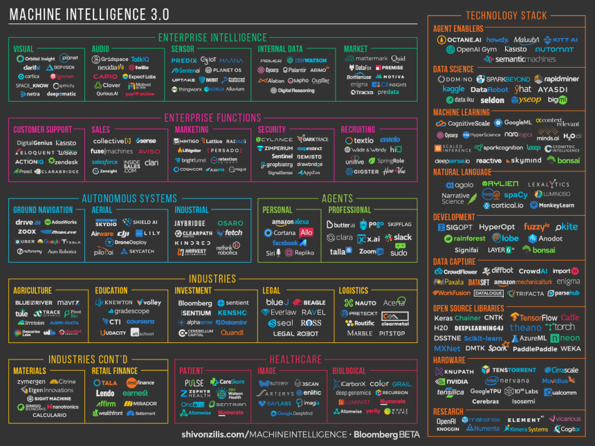

## Intelligent App Stack
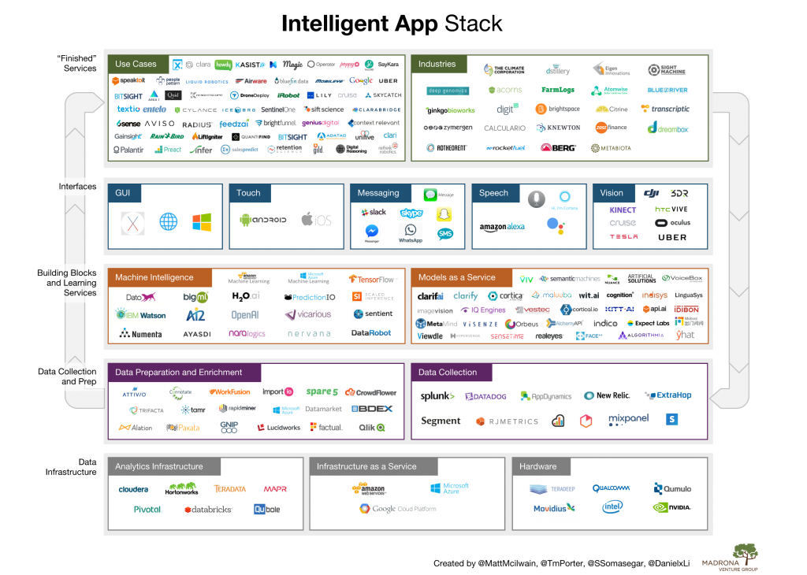

* Reference: [Machine Learning Trends and the Future of Artificial Intelligence](http://www.kdnuggets.com/2016/06/machine-learning-trends-future-ai.html)

## Machine Learning Model

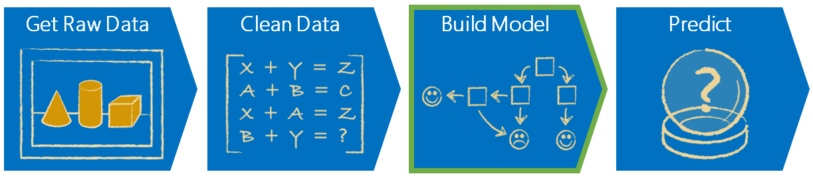

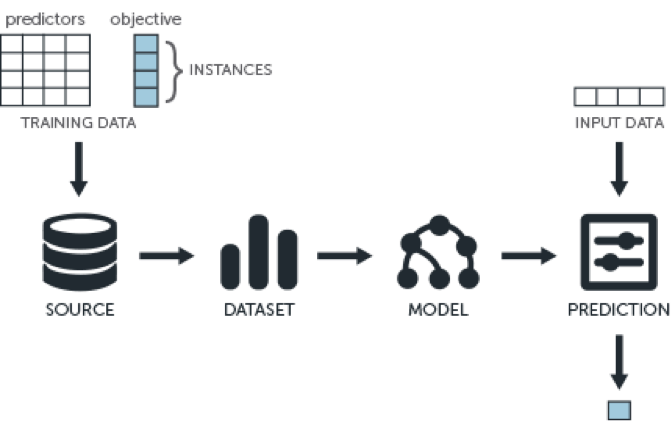

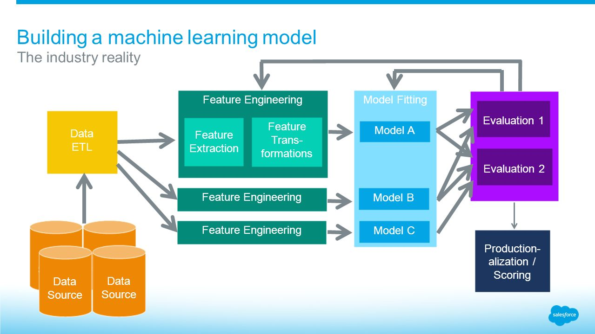

## Common Machine Learning Algorithim
* Logistic Regression 
* Decision Trees / Classification Trees
* AdaBoost (Boosted Decision Trees)
* Linear regression
* Neural Network
* Bayesian Network
* Support Vector Machine
* Nearest Neighbor
* Random Forests 

### Good links
* [What does each algorithm do?](http://oliviaklose.com/machine-learning-11-algorithms-explained/)
* [Building a Machine Learning Application](http://docs.aws.amazon.com/machine-learning/latest/dg/building-machine-learning.html)
* [An Introduction to 6 Machine Learning Models](https://dzone.com/articles/introduction-6-machine)
* [Advanced-spark-and-tensorflow](http://www.slideshare.net/cfregly/advanced-spark-and-tensorflow-meetup-may-26-2016)

## The features of Machine Learning model

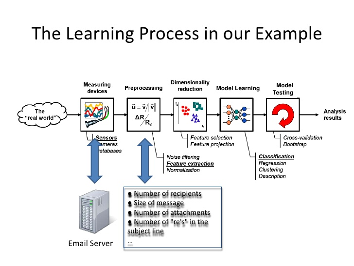
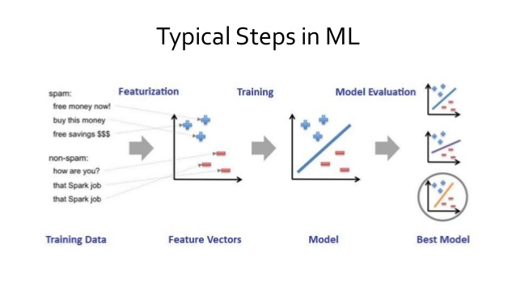

### Collecting and analyzing data
#### Training set
	* The labeled data - The target answer that you want to predic. 
	* Variables/features - These are attributes of the example that can be used to identify patterns to predict the target answer.
#### Test set
Evaluating data	

### Feature processing
### Training & Evaluating
#### Classification
Given training set (x,y), we want to create a classification model f(x) that can predict label y for a new x
The machine learning algorithm will create the function f
The predicted value of y for a new x is sign(f(x))
#### Improving model accuracy
#### Using the model to make predictions

### Retraining models on new data

### Good Readings
* [Evaluating Classifiers](http://slideplayer.com/slide/6194398/)
* [Evaluation of Learning Models](http://slideplayer.com/slide/6055073/)
* [Machine Learning Algorithm](http://www.slideshare.net/GirishKhanzode/supervised-learning-52218215)
* [Practical Data Science in Python](http://radimrehurek.com/data_science_python/)
* [Introduction to Machine Learning](http://www.slideshare.net/liorrokach/introduction-to-machine-learning-13809045)

## Programming languages for machine learning
	* R
	* Python

## Machine learning library

	* Computer vision
	* Natural Language Processing
	* Data Analysis / Data Visualization
	* Neural networks

### Machine learning library in python
#### Computer vision
* PCV
* SimpleCV
* Scitkit-Image

#### Natural Language Processing

	* spaCy
	* NLTK
	* Pattern
	* PyCUDA

#### Data Analysis / Data Visualization

	* SciPy
	* NumPy
	* Pandas
	* Scikit-learn
	* MIpy
	* matplotlib
	* NLTK
	* Statsmodels

## Samples of ML process

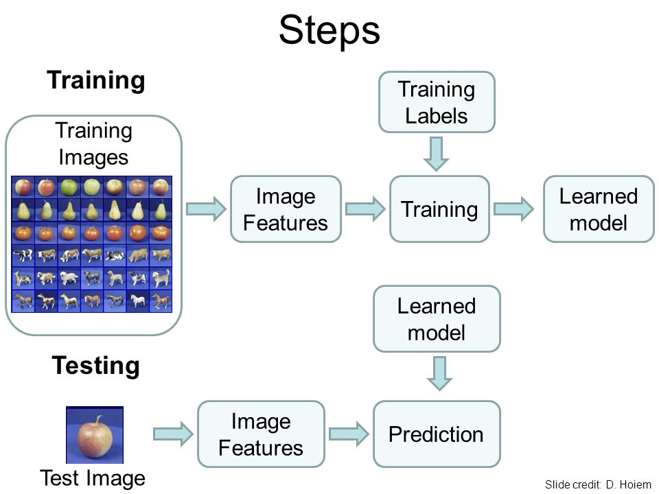

## The samples of machine learning Ecosystem

### Hadoop ecosystem

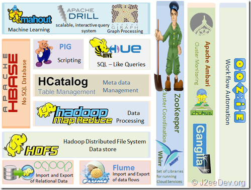
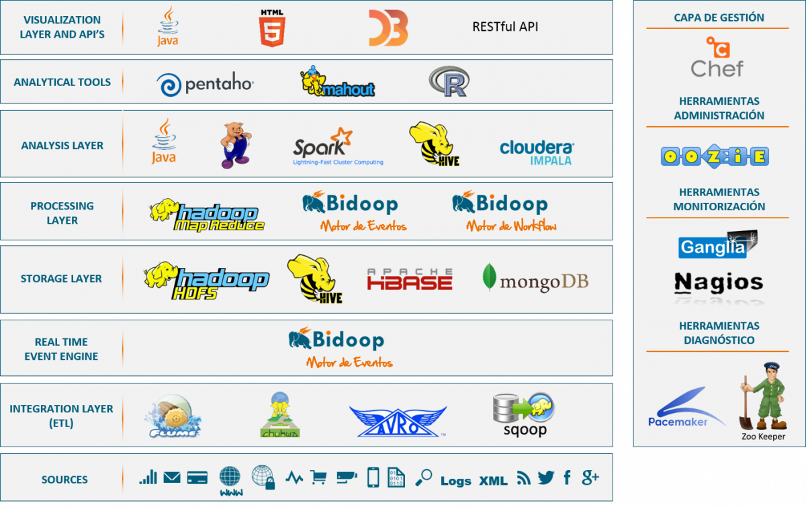

### GraphLab
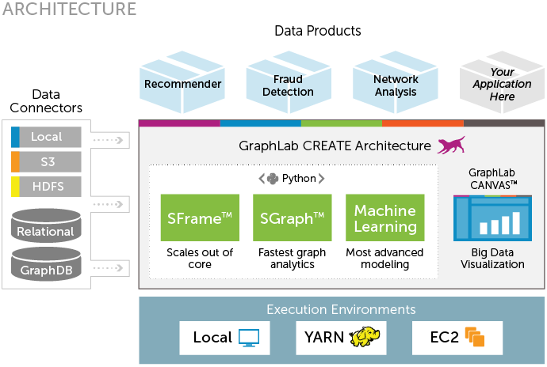

### Big Data for Better E-Commerce Search
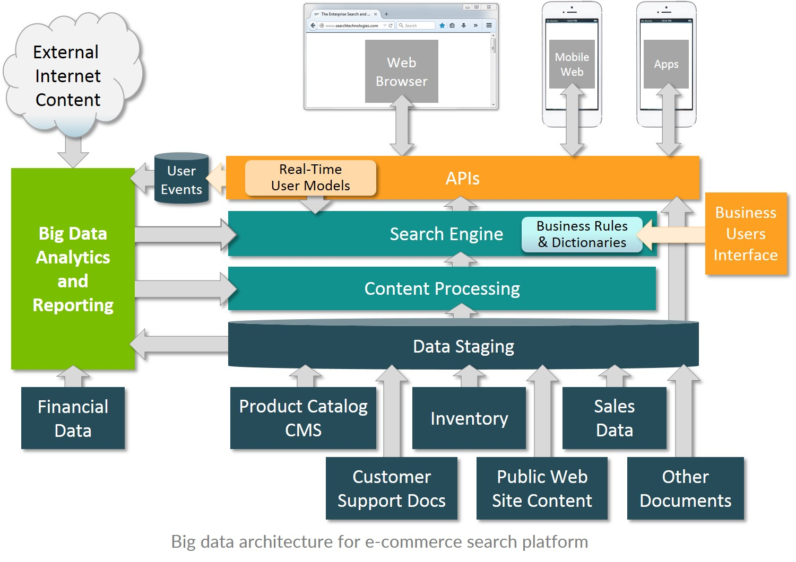	

#### Good links
* [Understanding Hadoop Ecosystem](https://savvycomsoftware.com/what-you-need-to-know-about-hadoop-and-its-ecosystem/)
* [Ecosystem of Hadoop Animal Zoo](https://dzone.com/articles/ecosystem-hadoop-animal-zoo-0)

### PipelineIO system

#### Good links
* [PinelineIO Architecture](https://github.com/fluxcapacitor/pipeline/wiki/Architecture-Overview)
* [Guidline](https://github.com/fluxcapacitor/pipeline/wiki/PipelineIO)

## Deep Learning

### Good readings
* [What’s the Difference Between Artificial Intelligence, Machine Learning, and Deep Learning?](https://blogs.nvidia.com/blog/2016/07/29/whats-difference-artificial-intelligence-machine-learning-deep-learning-ai/)
* [7 steps deep learning](http://www.kdnuggets.com/2016/01/seven-steps-deep-learning.html)
* [Dataset collection](http://deeplearning.net/datasets/)
* [Deep learning book online](http://neuralnetworksanddeeplearning.com/)
* [deeplearning.gitbooks.io](https://deeplearning.gitbooks.io/deep-learning-gently/content/index.html)

### Principle of neural network
Neural networks, a beautiful biologically-inspired programming paradigm which enables a computer to learn from observational data. 

[Reference 1](http://neuralnetworksanddeeplearning.com/chap1.html)
[Reference 2](https://ujjwalkarn.me/2016/08/09/quick-intro-neural-networks/)
[The Evolution and Core Concepts of Deep Learning & Neural Networks](https://www.analyticsvidhya.com/blog/2016/08/evolution-core-concepts-deep-learning-neural-networks/)

### Principle of deep learning
'Deep Learning' is the implementation of neural networks

Supervised network model

Unsupervised network model

#### Good readings
* [Deep Learning in a Nutshell: Core Concepts](https://devblogs.nvidia.com/parallelforall/deep-learning-nutshell-core-concepts/#h5o-9)

### Deploy Deep Learning system

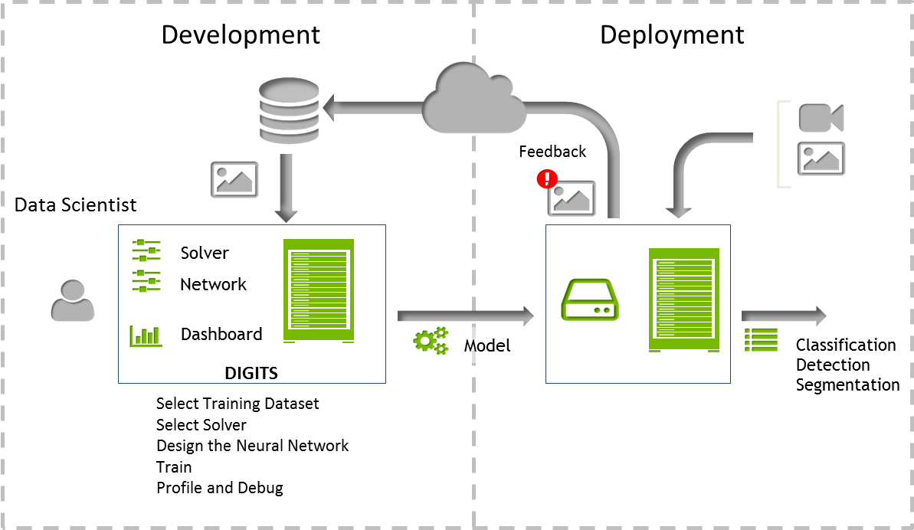

### Deep learning framework

	* Theano(Python)
	* Caffe
	* Microsoft CNTK(C++)
	* TensorFlow(Python)
	* Torch(Lua)
	* MXnet
	* Chainer(Python)
	* Keras(Python)
	* MarConvNet(MatLab)

### Samples

[A simple network to classify handwritten digits](http://neuralnetworksanddeeplearning.com/chap1.html#a_simple_network_to_classify_handwritten_digits)
