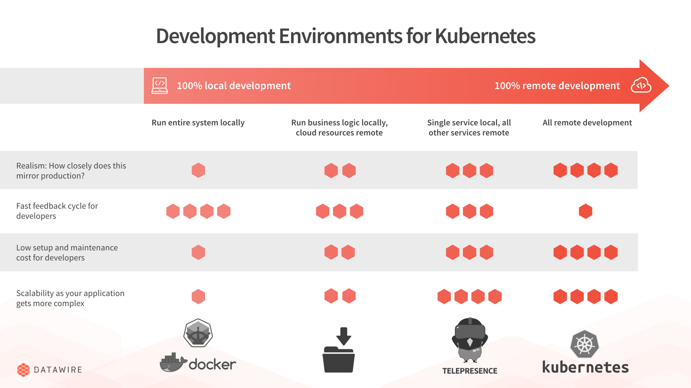

Strategy to Deploy Microservices
==========================================

## Good reads
* [Best-practices-for-building-a-microservice-architecture](http://www.vinaysahni.com/best-practices-for-building-a-microservice-architecture)
* [Container-orchestration-with-kubernetes](https://medium.com/onfido-tech/container-orchestration-with-kubernetes-an-overview-da1d39ff2f91)
* [Deployment-strategy-for-microservices-on-kubernetes-cluster](https://medium.com/@DockerTurtle/deployment-strategy-for-microservices-on-kubernetes-cluster-c03913a63c2f)
* [Deployment with jhipster](http://www.jhipster.tech/kubernetes/)
* [Implememt Service-discovery](https://lostechies.com/gabrielschenker/2016/01/27/service-discovery/)
* [Microservices-deployment-patterns](https://www.slideshare.net/iamabhishektiwari/microservices-deployment-patterns-63249852)
* [Working-locally-with-microservices](https://opencredo.com/working-locally-with-microservices/)

## Standard deployment
[Reference](https://medium.com/@DockerTurtle/deployment-strategy-for-microservices-on-kubernetes-cluster-c03913a63c2f)

__The naming convention__

We need to document the naming convention for each Resource. This is the most important Task in creating a Cloud native design pattern.

    Project name (collection of Microservices)
    Microservice name
    Team owner name (single Microservice group of Dev, QA and Ops)
    Github repo name
    Jenkins Job name (multiple Jobs)
    Docker Repo name
    Docker Image Tag
    Kube Manifest Files (deployment.yaml, service.yaml, etc)
    Kube cluster name
    Kube Namespace name
    Env name (PR, QA, Staging, Prod)
    Kube Deployment name
    Kube Pod name
    Kube Pod labels
    Kube ConfigMap name
    Kube Secret name
    CPU
    RAM
    Number of Microservice Instances (Num of Kube Pod Replicaset)
    Kube Service name for Microservice (Private Load balancer DNS name)
    Kube Ingress name for Microservice (External Load balancer DNS name)

__Operation management__

    Single central Log store for Microservice instances
    Single central Metrics Time series database for Microservice instances
    Host, Containers and App Monitoring Dashboard
    RBAC for security
    Network policies & monitoring (SDN/NFV Tools Calico, Opencontrail)

## Deployment Workflow
[Fast-develop-deploy-canary-workflow](https://www.datawire.io/guide/development/fast-develop-deploy-canary-workflow/)

Getting source code deployed into Kubernetes so you can test it requires the following steps:

    Build a Docker container that contains your source code and any runtime dependencies.
    Push the container to a container registry.
    Write a Kubernetes manifest. The manifest tells Kubernetes what to run (i.e., it points to the container) and how to run it (e.g., what ports to expose, or the maximum amount of memory to allocate).
    Tell Kubernetes to process the manifest, using kubectl, the Kubernetes command line tool.

## Scenario Deploymeny

__Option #1: Spin up the full system locally__

__Option #2: Spin up the full system in cloud__

__Option #3: Spin up all business logic locally, route cloud services to laptop__

__Option #4: make local code for single service available in remote cluster__

### Tools

## Service Discovery

## Services Interaction

## Logging

## Monitoring

