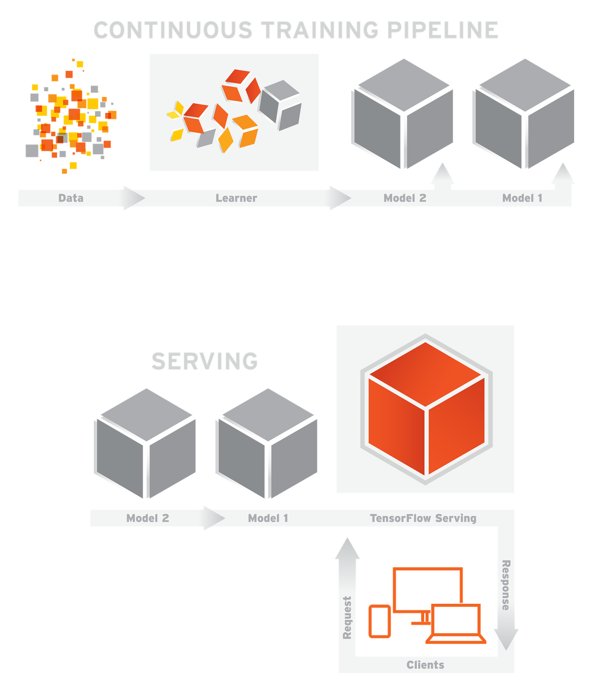

TensorFlow
==============================================
## Reference
* [TensorFlow](https://www.tensorflow.org/)
* [LearningTensorFlow](http://learningtensorflow.com/getting_started/) 
* [Tflearn](http://tflearn.org/)
* [Deep Learning with Apache Spark and TensorFlow](https://databricks.com/blog/2016/01/25/deep-learning-with-apache-spark-and-tensorflow.html)
* [Bringing Deep Learning into production](http://www.slideshare.net/ds_mi/bringing-deep-learning-into-production-paolo-platter-agilelab)

## Overview

## Architecture

## Installing

Requirements:

	* Python 2.7, 3.3

The different ways to install TensorFlow:

	* Pip install
	* Virtualenv install
	* Anaconda install
	* Docker install
	* Installing from sources

[Details](https://www.tensorflow.org/versions/r0.11/get_started/os_setup.html#download-and-setup)

## TensorFlow Landscape
	* TensorFlow Core
	* TensorFlow Distributed
	* TensorFlow Serving - Model deployment (Similar to Prediction.io, Pipeline.io, Spark ML)
	* TensorBoard (Virtualize Neural Networking Training)
	* Playground
	* SkFlow (Scikit-Learn + TensorFlow)
	* Keras (Hi-level API for both TensorFlow and Theano)
	* Models 
### Good links
* [Advanced-spark-and-tensorflow](http://www.slideshare.net/cfregly/advanced-spark-and-tensorflow-meetup-may-26-2016)

## Deployment Architecture

### Good links

* [Deploying deep learning models with Docker and Kubernetes](http://www.slideshare.net/PetteriTeikariPhD/deploying-deep-learning-models-with-docker-and-kubernetes)
* [Supercharging Android Apps With TensorFlow ](https://jalammar.github.io/Supercharging-android-apps-using-tensorflow/)

## The Sample of Tensor deployment

### PipelineIO

#### Good links
* [Guidline](https://github.com/fluxcapacitor/pipeline/wiki/PipelineIO)
* [PipelineIO_architecture-overview](https://github.com/fluxcapacitor/pipeline/wiki/Architecture-Overview)

### TensorFlow Serving

#### Good links
* [TensorFlow Serving](https://tensorflow.github.io/serving/)
* [Running your models in production with TensorFlow Serving](https://opensource.googleblog.com/2016/02/running-your-models-in-production-with.html)
